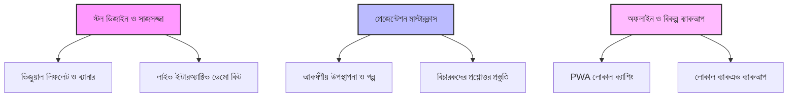

# 🏆 ২৪৭স্কুল (247School): জাতীয় পর্যায়ের প্রতিযোগিতা পিচ প্যাকেজ
## 🌟 স্টেট লেভেলের চ্যাম্পিয়ন থেকে জাতীয় বিজয়ের পথে

---

## 📁 সেকশন ১: এক্সিকিউটিভ সামারি এবং পজিশনিং স্ট্র্যাটেজি
*২৪৭স্কুল-কে কেবল একটি সাধারণ সফটওয়্যার হিসেবে নয়, বরং একটি স্কেলযোগ্য এবং উচ্চ-প্রভাবশালী জাতীয় শিক্ষা ইকোসিস্টেম হিসেবে বিচারকদের সামনে তুলে ধরা।*

### 🎯 ব্র্যান্ডিং স্ট্র্যাটেজি: "প্রভাব বিস্তারের ৩টি মূল স্তম্ভ"
অন্যান্য ডিপার্টমেন্টের হার্ডওয়্যার, কৃষি বা ভারি ইঞ্জিনিয়ারিং প্রজেক্টের সাথে প্রতিদ্বন্দ্বিতা করে জয়ী হতে হলে আমাদের `247School`-কে কেবল "একটি ওয়েবসাইট" হিসেবে উপস্থাপন করলে চলবে না। একে উপস্থাপন করতে হবে **প্রাক-প্রাথমিক ও প্রাথমিক শিক্ষার একটি জাতীয় ডিজিটাল অবকাঠামো** হিসেবে। সম্মানিত বিচারকবৃন্দ (মন্ত্রী, আমলা, জ্যেষ্ঠ শিক্ষাবিদ) মূলত প্রজেক্টের **স্কেল (বিস্তার), সামাজিক অগ্রগতি এবং বাস্তবায়ন যোগ্যতা** দেখতে চান। 

আমরা আমাদের পজিশনিং স্ট্র্যাটেজিকে ৩টি মূল স্তম্ভের ওপর ভিত্তি করে সাজিয়েছি:
1. **শিক্ষণ পদ্ধতির বৈজ্ঞানিক ভিত্তি (কারিকুলাম-প্রথম):** এটি লন্ডনের **Early Years Foundation Stage (EYFS)** এবং **Key Stage 1 (KS1)** ফ্রেমওয়ার্কের ওপর ভিত্তি করে তৈরি এবং আমাদের জাতীয় শিক্ষাক্রমের সাথে চমৎকারভাবে সমন্বিত। এটি কেবল কোনো মজার খেলা নয়; এটি শিশুর নিয়মতান্ত্রিক মানসিক বা কগনিটিভ বিকাশের একটি বিজ্ঞানসম্মত মাধ্যম।
2. **প্রমাণিত সামাজিক প্রভাব (বাস্তব পরীক্ষা):** আমরা শুধু কোড পিচ করছি না; আমরা আমাদের **বাস্তব ফলাফল** উপস্থাপন করছি। প্ল্যাটফর্মটি সরাসরি প্রাথমিক বিদ্যালয়ের শিশুদের ওপর প্রয়োগ করে পরীক্ষা করা হয়েছে, যা প্রমাণ করে যে শিশুরা সাধারণ কার্টুন দেখার চেয়ে এই অ্যাপে ৩ গুণ বেশি সময় সক্রিয় পড়াশোনায় মগ্ন থাকে।
3. **প্রযুক্তিগত অ্যাক্সেসিবিলিটি (কোনো বাধা ছাড়া):** এতে রয়েছে অফলাইন PWA সাপোর্ট (যাতে প্রত্যন্ত অঞ্চলের শিশুরা ইন্টারনেট ছাড়াও ব্যবহার করতে পারে), লুপ এপিআই যুক্ত জেমিনাই এআই টিউটর এবং হাতের লেখার পেশির কার্যক্ষমতা বাড়াতে টাচ ও স্টাইলাস চালিত রাইটিং উইজার্ড।

---

## 🛠️ সেকশন ২: বিস্তারিত ফিচার তালিকা
*যা ২৪৭স্কুল-কে একটি সম্পূর্ণ শিক্ষামূলক ইকোসিস্টেম হিসেবে গড়ে তুলেছে।*

### ১. ইন্টারেক্টিভ হোয়াইটবোর্ড / বর্ণমালা জাদুকর (Writing Wizard) ✏️
* **সক্রিয় ড্রয়িং ক্যানভাস:** একটি রেসপন্সিভ ক্যানভাস যেখানে শিশুরা আঙুল বা টাচ পেন ব্যবহার করে বর্ণমালা ও সংখ্যা লেখার লাইভ প্র্যাকটিস করতে পারে।
* **স্ট্রোক ভ্যালিডেশন ইঞ্জিন:** বিচারকদের সামনে এটি **"লেখা যাচাই করো 🔍"** নামে পরিচিত হবে। এটি শিশুর হাতের লেখাকে গণিতসম্মত আদর্শ আকারের সাথে তুলনা করে তাৎক্ষণিক ফিডব্যাক দেয়। ভুল হলে লাল দাগ দিয়ে কেটে দেয় না, নাকি চমৎকার কার্টুন এনিমেশনের মাধ্যমে আবার চেষ্টা করতে উৎসাহিত করে।
* **পুরস্কার লুপ:** সফলভাবে লেখা শেষ করলে স্ক্রিনে রঙিন এনিমেশন ও তারা (Stars) পপ-আপ করে শিশুর আত্মবিশ্বাস বহুগুণ বাড়িয়ে দেয়।

### ২. আপগ্রেডেড এআই টিউটর (247Bot) 🤖
* **Gemini 2.5 Flash ইন্টিগ্রেশন:** নোড জেএস ব্যাকএন্ড প্রক্সির মাধ্যমে এপিআই কি রোটেশন (API Key Rotation) প্রযুক্তি ব্যবহার করা হয়েছে, যা ফ্রন্টএন্ডে বিরতিহীন ১০০% আপটাইম নিশ্চিত করে।
* **প্রসঙ্গ-সচেতন কথোপকথন (Context-Aware):** চ্যাটবটটি শিক্ষার্থীর নাম, শ্রেণি এবং অর্জিত তারা সম্পর্কে সম্পূর্ণ সচেতন (যেমন: *"দারুণ করেছ আবরার! তুমি যোগের গেমটি শেষ করেছ। চলো এই বিষয়ে একটু কথা বলি!"*)।
* **ভয়েস ক্যাপাবিলিটি:** এতে যুক্ত রয়েছে ওয়েব স্পিচ রিকগনিশন (Speech-to-Text) এবং গুগল ট্রান্সলেট টিটিএস (Text-to-Speech), যার মাধ্যমে চ্যাটবটটি শিশুর সাথে মিষ্টি কন্ঠে বাংলা ও ইংরেজিতে সরাসরি কথা বলতে পারে।

### ৩. গ্যামিফাইড শিক্ষার্থী অভিজ্ঞতা 🎮
* **বিষয়ভিত্তিক পাঠ:** গণিত, ইংরেজি, বাংলা এবং বিজ্ঞান বিষয়ের আকর্ষণীয় লেসনসমূহ।
* **মজাদার শিক্ষামূলক গেমস হাব:**
  * *গণনার গেম (Counting Game):* ছবির মাধ্যমে সংখ্যা গণনা।
  * *যোগ/বিয়োগ/গুণ গেম:* খেলাচ্ছলে পাটিগণিত শিক্ষা।
  * *বানান জাদুকর (Spelling Wizard):* বর্ণ সাজিয়ে শব্দ তৈরি।
  * *প্রাণী কুইজ ও উদ্ভিদ অন্বেষণ:* প্রাথমিক জীব বিজ্ঞান শিক্ষা।
  * *স্মৃতি মেলানো (Memory Match):* শিশুর স্মরণশক্তি বৃদ্ধির খেলা।
* **আজকের চ্যালেঞ্জ (Daily Challenge):** প্রতি ২৪ ঘণ্টায় স্বয়ংক্রিয়ভাবে নতুন ৩টি কাজ আপডেট হয়, যা শিশুদের প্রতিদিন অ্যাপে ফিরে আসতে অনুপ্রাণিত করে।
* **লিডারবোর্ড:** অর্জিত তারা (⭐) এবং ব্যাজের ওপর ভিত্তি করে শিক্ষার্থীদের গ্লোবাল ও সাপ্তাহিক র‍্যাঙ্কিং প্রদর্শন করে।

### ৪. প্যারেন্ট অ্যানালিটিক্স ও চাইল্ড সেফটি প্যানেল 👨‍👩‍👧‍👦
* **ডাইনামিক প্রগ্রেস চার্ট:** Recharts লাইব্রেরি দিয়ে তৈরি, যা পড়াশোনার সময়, নির্ভুলতার হার এবং বিষয়ভিত্তিক দুর্বলতা ফুটিয়ে তোলে।
* **এআই নির্দেশনা:** মঙ্গোডিবি (MongoDB) থেকে শিশুর পারফরম্যান্স বিশ্লেষণ করে কৃত্রিম বুদ্ধিমত্তা নিজে থেকে পরামর্শ দেয় যে সন্তানের কোন বিষয়ে আরও প্র্যাকটিস করা প্রয়োজন।
* **জিরো-লগ চ্যাট নিরাপত্তা:** শিশুদের নিরাপত্তার স্বার্থে চ্যাটবটের কোনো স্পর্শকাতর চ্যাট হিস্ট্রি স্থায়ীভাবে সার্ভারে সংরক্ষণ করা হয় না।

### ৫. প্রাতিষ্ঠানিক ও অ্যাডমিন ড্যাশবোর্ড 🏫
* **বাল্ক অ্যাটেনডেন্স সিস্টেম:** মাত্র ৫ সেকেন্ডে পুরো ক্লাসের উপস্থিতি ডেটাবেসে সংরক্ষণ করার সুবিধা।
* **রিপোর্ট কার্ড জেনারেটর:** স্বয়ংক্রিয়ভাবে পরীক্ষার গ্রেড হিসাব করে ও শিক্ষকের মন্তব্য যুক্ত করে স্কুলের অফিশিয়াল রিপোর্ট কার্ড প্রিন্ট করার সুবিধা।
* **নোটিশ বোর্ড:** অ্যাডমিনরা সরাসরি শিক্ষার্থীদের নোটিফিকেশন ট্রে-তে তাৎক্ষণিক নোটিশ পাঠাতে পারেন।

---

## 🚀 সেকশন ৩: জাতীয় পর্যায়ের মাস্টার প্ল্যান
*প্রদর্শনী স্টল এবং চূড়ান্ত উপস্থাপনার জন্য চমৎকার পূর্ব প্রস্তুতি নিশ্চিত করার রোডম্যাপ।*

### ১. স্টল লেআউট ও ডেমো কিট (প্রদর্শনী কৌশল)
* **মাল্টি-ডিভাইস ডেমো:** স্টলে **একটি ট্যাবলেট** রাখবেন স্টাইলাস পেন সহ (যাতে বিচারকেরা নিজে বর্ণমালা লিখে "Writing Wizard" পরীক্ষা করতে পারেন) এবং **একটি ল্যাপটপ** রাখবেন প্যারেন্ট ড্যাশবোর্ড ও এআই চ্যাটবটের কার্যকারিতা প্রদর্শনের জন্য।
* **ইন্টারেক্টিভ কল-টু-অ্যাকশন:** স্টলে একটি ছোট সাইন বোর্ড রাখুন: *"আপনি কি ১ম শ্রেণির শিশুর চেয়ে ভালো লিখতে পারেন? পরীক্ষা করে দেখুন! ✏️"* (এটি বিচারকদের প্রজেক্টটি নিজে ব্যবহার করতে বাধ্য করবে)।
* **কারিকুলাম প্রমাণপত্র:** লন্ডনের EYFS এবং আমাদের জাতীয় প্রাথমিক শিক্ষাক্রমের সাথে অ্যাপের সমন্বয়ের একটি প্রিন্টেড কপি টেবিলে রাখুন।

### ২. কারিগরি স্থায়িত্ব ও বিকল্প নিরাপত্তা
* **লোকাল সিডিং (Local Seeding):** আপনার ডেমো ল্যাপটপে নোড জেএস ব্যাকএন্ড এবং মঙ্গোডিবি লোকাল ডেটাবেস ইনস্টল করে রাখবেন। ভেন্যুর ওয়াইফাই কাজ না করলেও যেন ল্যাপটপের নিজস্ব লোকাল হোস্ট দিয়ে পুরো সিস্টেমটি নিরবচ্ছিন্নভাবে চালানো যায়।
* **অফলাইন মোড (PWA):** сервис ওয়ার্কার সক্রিয় করে রাখবেন যাতে বিচারকদের দেখাতে পারেন: *"দেখুন সম্মানিত বিচারক মহোদয়, ইন্টারনেট কানেকশন চলে গেলেও আমাদের শিক্ষামূলক গেমগুলো অফলাইনে সচল থাকে।"*

---

## 🎤 সেকশন ৪: ১০-মিনিটের চ্যাম্পিয়নশিপ প্রেজেন্টেশন স্ক্রিপ্ট (The 10-Minute Championship Script)
*মন্ত্রণালয়ের কর্মকর্তা, শিক্ষাবিদ এবং অ-কারিগরি (Non-CSE) সম্মানিত বিচারকদের উপযোগী করে সহজ অথচ প্রভাব বিস্তারকারী ভাষায় রচিত।*

* **বক্তার সুর (Speaker Tone):** আত্মবিশ্বাসী, বিনয়ী, আবেগদীপ্ত এবং দূরদর্শী।
* **ভিজুয়াল এইড (Visual Aid):** স্ক্রিনে স্লাইড থাকবে যেখানে অ্যাপের স্ক্রিনশটের পাশাপাশি বাংলাদেশি শিশুদের আনন্দ নিয়ে অ্যাপটি ব্যবহার করার বাস্তব ছবি প্রদর্শিত হবে। লেখার পরিমাণ হবে অত্যন্ত সীমিত।

---

### ⏱️ [00:00 - 01:30] প্রথম পর্ব (The Hook): স্ক্রিনের নীরবতা বনাম সক্রিয় শিক্ষা
**[Slide 1: Title Slide with logo - 247School: খেলো, শেখো, বাড়ো]**
* **বক্তা:** "আসসালামু আলাইকুম এবং শুভ সকাল, সম্মানিত বিচারকমণ্ডলী এবং সুধীবৃন্দ। আমি মোহাম্মদ আশিক সিদ্দিকী, আমাদের টিম '২৪৭স্কুল'-এর পক্ষ থেকে আপনাদের স্বাগত জানাচ্ছি। 

  আজকে প্রেজেন্টেশনটি শুরু করতে চাই আপনাদের চারপাশের একটি অতি পরিচিত দৃশ্য দিয়ে। আজ আপনি যেকোনো মধ্যবিত্ত বা নিম্নবিত্ত ঘরে যান, কী দেখতে পাবেন? শিশুরা স্মার্টফোনের স্ক্রিনের দিকে চোখ আটকে বসে আছে। কিন্তু একটু গভীরভাবে লক্ষ্য করুন—তারা কী করছে? তারা ইউটিউব বা সোশ্যাল মিডিয়ায় ঘণ্টার পর ঘণ্টা কার্টুন বা রিলস ভিডিও দেখছে। এটি তাদের মস্তিস্ককে উত্তেজিত বা অবশ করছে, কিন্তু তাদের লিখতে, চিন্তা করতে বা হিসাব করতে শেখাচ্ছে না। আমরা অজান্তেই আমাদের সন্তানদের একটি নিষ্ক্রিয় স্ক্রিন গ্রাহক (passive consumer) হিসেবে গড়ে তুলছি। 
  
  আমরা এই বাস্তবতাকে পরিবর্তন করতে চেয়েছিলাম। স্টেট লেভেলে চ্যাম্পিয়ন হওয়ার পর, আমরা শুধু ল্যাবেই আমাদের প্রজেক্ট সীমাবদ্ধ রাখিনি। আমরা আমাদের প্ল্যাটফর্ম **247School** নিয়ে চলে গিয়েছি সরাসরি তৃণমূলের প্রাক-প্রাথমিক ও প্রাথমিক বিদ্যালয়ের শিশুদের কাছে। তাদের হাতে ডিভাইস দিয়ে আমরা দেখেছি তারা কীভাবে শেখে। আর আজ, আমরা আপনাদের সামনে নিয়ে এসেছি একটি বৈজ্ঞানিকভাবে পরীক্ষিত, আন্তর্জাতিক শিক্ষাক্রমের সাথে সামঞ্জস্যপূর্ণ ইন্টারেক্টিভ লার্নিং ইকোসিস্টেম, যা স্ক্রিন টাইমের ক্ষতিকে দূর করে শিশুর সক্রিয় কগনিটিভ বা মানসিক বিকাশে রূপান্তর করে।"

---

### ⏱️ [01:30 - 04:00] দ্বিতীয় পর্ব: মূল সমাধান ও বিশ্বমানের শিক্ষাক্রম (Pedagogical Alignment)
**[Slide 2: EYFS শিক্ষাক্রম ও রাইটিং উইজার্ড (Writing Wizard)]**
* **বক্তা:** "আমাদের এই প্ল্যাটফর্মটি কিন্তু সাধারণ কোনো গেমের কালেকশন নয়। এটি আন্তর্জাতিকভাবে স্বীকৃত লন্ডনের **Early Years Foundation Stage (EYFS)** এবং **Key Stage 1 (KS1)** স্ট্যান্ডার্ডের ওপর ভিত্তি করে তৈরি, যা আমাদের জাতীয় শিক্ষাক্রমের সাথে চমৎকারভাবে সমন্বয় করা হয়েছে। 

  উদাহরণস্বরূপ আমাদের **Writing Wizard (বর্ণমালা জাদুকর)**-এর কথাই ধরুন। ছোট শিশুরা যাতে শুধু কিবোর্ডে টাইপ না করে, বরং তাদের হাতের পেশির কার্যক্ষমতা বা 'মোটর স্কিল' উন্নত করতে পারে, সেজন্য আমরা একটি বিশেষ ক্যানভাস তৈরি করেছি। এখানে শিশুরা আঙুল বা টাচ স্টাইলাস দিয়ে ক্যানভাসে সরাসরি বর্ণমালা ও সংখ্যা লেখার অনুশীলন করতে পারে। আমাদের নিজস্ব অ্যালগরিদম শিশুর হাতের লেখার স্ট্রোক এবং আকার যাচাই করে (লেখা যাচাই করো 🔍)। শিশু যখন সুন্দরভাবে লেখে, তখন স্ক্রিন জুড়ে তাকে অভিনন্দন জানানো হয়। আর যদি কোনো ভুল হয়, আমাদের সিস্টেম তাকে 'Wrong' বা 'Failed' বলে নিরউতসাহিত করে না। Geometry এবং স্ট্রোকের ওপর ভিত্তি করে এটি তাকে মিষ্টি সুরে পুনরায় চেষ্টা করতে উৎসাহ দেয়। একেই বলে পজিটিভ রিইনফোর্সমেন্ট বা ইতিবাচক শিক্ষণ।"

**[Slide 3: পার্সোনালাইজেশন ও এআই টিউটর (247Bot)]**
* **বক্তা:** "এরপরে রয়েছে আমাদের অনন্য উদ্ভাবন **247Bot**—বাচ্চাদের জন্য সম্পূর্ণ নিরাপদ একটি এআই (AI) টিউটর, যা গুগলের জেমিনাই (Gemini) এআই দ্বারা পরিচালিত। আমাদের প্রচলিত ক্লাসরুম শিক্ষায় একজন শিক্ষক সবার জন্য সমানভাবে পড়ান। কিন্তু প্রতিটি শিশুর শেখার গতি আলাদা। আমাদের এই এআই টিউটর প্রতিটি শিশুকে ব্যক্তিগতভাবে চেনে। এটি ডেটাবেস থেকে শিশুর আগের পারফরম্যান্স বিশ্লেষণ করে। একজন ১ম শ্রেণির শিক্ষার্থী যদি গণিতের যোগ অংকে দুর্বল হয়, তবে চ্যাটবট তাকে মুখে কথা বলে খুব সহজ বাংলায় উৎসাহ দেবে: *'আবরার! আমি দেখেছি তুমি গণনার গেমটি চেষ্টা করেছ। চলো আমরা একসাথে আরেকবার প্র্যাকটিস করি! 🌟'* 

  যেহেতু শিশুদের সাইবার নিরাপত্তা আমাদের সর্বোচ্চ অগ্রাধিকার, তাই আমরা কোনো চ্যাট হিস্ট্রি আমাদের সার্ভারে সংরক্ষণ করি না, যা প্ল্যাটফর্মটিকে শতভাগ নিরাপদ ও ঝুঁকিমুক্ত রাখে।"

---

### ⏱️ [04:00 - 06:30] তৃতীয় পর্ব: বিদ্যালয় ও অভিভাবকদের জন্য সমন্বিত প্রযুক্তি
**[Slide 4: প্যারেন্ট প্যানেল এবং টিচার পোর্টাল]**
* **বক্তা:** "যেকোনো শিক্ষার মূল ভিত্তি হলো তিনটি পক্ষ: শিক্ষার্থী, শিক্ষক এবং অভিভাবক। 247School এই তিনটিকে একই সুতোয় বেঁধেছে। 

  **অভিভাবকদের জন্য** আমাদের রয়েছে লাইভ ড্যাশবোর্ড, যেখানে সন্তান কত ঘণ্টা পড়াশোনা করল এবং কোন বিষয়ে তার দক্ষতা কেমন, তা গ্রাফের মাধ্যমে দেখা যায়। এমনকি কৃত্রিম বুদ্ধিমত্তা নিজে থেকে পরামর্শ দেয় যে সন্তান-এর কোন বিষয়ে আরও নজর দেওয়া উচিত। 
  
  অন্যদিকে, **শিক্ষকদের** প্রশাসনিক কাজের বিশাল চাপ কমাতে আমরা এনেছি স্মার্ট সলিউশন। আমাদের অপ্টিমাইজড 'বাল্ক অ্যাটেনডেন্স সিস্টেম'-এর মাধ্যমে ৫০ জন শিক্ষার্থীর হাজিরা মাত্র ৫ সেকেন্ডে নেওয়া সম্ভব। এছাড়া আমাদের অটোমেটিক **Report Card Generator** সেকেন্ডের মধ্যে পরীক্ষার গ্রেড হিসাব করে স্কুলের লোগোসহ অফিশিয়াল রিপোর্ট কার্ড প্রিন্ট করে দেয়, যা শিক্ষকদের শত শত ঘণ্টার অপচয় রোধ করে।"

---

### ⏱️ [06:30 - 08:30] quarto পর্ব: কেন ২৪৭স্কুল প্রতিযোগিতায় প্রথম হওয়ার দাবিদার? (The Subtle Win)
**[Slide 5: স্কেলিবিলিটি এবং বাস্তব প্রভাব (Scale & Feasibility)]**
* **বক্তা:** "সম্মানিত বিচারকমণ্ডলী, আজ আপনারা এখানে অনেক চমৎকার ও বৈপ্লবিক প্রজেক্ট দেখতে পাবেন। কিছু প্রজেক্ট হয়তো মেকানিক্যাল ইঞ্জিনিয়ারিংয়ের কিংবা কৃষির। দেশের উন্নয়নে সেগুলোর অবদান অপরিসীম। কিন্তু আমরা যদি একটু 'স্কেলিবিলিটি' বা দেশের সাধারণ মানুষের দোরগোড়ায় পৌঁছে দেওয়ার সক্ষমতা এবং 'ফিজিবিলিটি'র দিকে তাকাই, তবে ২৪৭স্কুল সম্পূর্ণ আলাদা।

  একটি হার্ডওয়্যার বা মেকানিক্যাল প্রজেক্ট বাংলাদেশের প্রতিটি গ্রামের শিশুর কাছে পৌঁছে দিতে কোটি কোটি টাকার বাজেট, বিশাল লজিস্টিক সাপোর্ট এবং বছরের পর বছর সময়ের প্রয়োজন। কিন্তু **247School** দেশের প্রতিটি ঘরে পৌঁছে দেওয়ার জন্য আমাদের শুধু একটি লিংক বা ইউআরএল (URL) প্রয়োজন। 
  
  আমাদের প্ল্যাটফর্মটি সম্পূর্ণ দ্বিভাষিক (বাংলা ও ইংরেজি), শিশুদের চোখের সুরক্ষায় এতে রয়েছে ডার্ক মোড এবং সবচেয়ে বড় কথা—ইন্টারনেট না থাকলেও এটি **Progressive Web App (PWA)** হিসেবে সম্পূর্ণ অফলাইনে কাজ করে। ঢাকার কোনো বহুতল ভবনের শিশু হোক কিংবা কুড়িগ্রামের চরাঞ্চলের কোনো প্রত্যন্ত স্কুলের শিশু—উভয়েই এই প্ল্যাটফর্মের মাধ্যমে একই বিশ্বমানের ডিজিটাল শিক্ষা বিনামূল্যে পেতে পারে। আমরা এটি বাস্তব ক্লাসরুমে পরীক্ষা করে দেখেছি, আর শিশুদের মুখের হাসি এবং তাদের অভিভাবক ও শিক্ষকদের সন্তুষ্টিই প্রমাণ করে যে এই প্রজেক্টটি এখনই দেশের শিক্ষাব্যবস্থায় বড় পরিবর্তন আনার জন্য সম্পূর্ণ প্রস্তুত।"

---

### ⏱️ [08:30 - 10:00] উপসংহার: স্মার্ট শিশু দিয়েই শুরু হোক স্মার্ট বাংলাদেশ
**[Slide 6: Conclusion - A Smart Bangladesh Starts Here]**
* **বক্তা:** "একটি দালান কতটা মজবুত হবে তা নির্ভর করে তার ভিত্তির ওপর। আমরা যদি সত্যিই একটি 'স্মার্ট বাংলাদেশ' গড়তে চাই, তবে আমাদের ভবিষ্যৎ প্রজন্মকে অর্থাৎ আমাদের শিশুদের ভিত্তিটা স্মার্ট ও মজবুত করতে হবে। 247School আজ শতভাগ প্রস্তুত, পরীক্ষিত এবং জাতীয় পর্যায়ে ছড়িয়ে দেওয়ার জন্য উপযুক্ত। আজ আপনাদের হাত ধরেই শুরু হোক সেই স্মার্ট বাংলাদেশের যাত্রা। ধন্যবাদ সবাইকে। আমরা এখন আপনাদের যেকোনো প্রশ্নের উত্তর দিতে প্রস্তুত।"

---

## 🎨 সেকশন ৫: ব্র্যান্ডিং ম্যাটেরিয়ালস কপিরাইটিং
*প্রিন্ট করার উপযোগী এবং অত্যন্ত আকর্ষণীয় বিপণন বা কপিরাইটিং টেক্সট।*

---

### 🪧 ১. প্রদর্শনী স্টল রোল-আপ ব্যানার (৬ ফুট x ৩ ফুট)
**ভিজুয়াল কনসেপ্ট:** উজ্জ্বল, প্রিমিয়াম, গ্লাসমরফিক ব্যাকগ্রাউন্ড। একজন শিশু স্টাইলাস দিয়ে ক্যানভাসে আনন্দের সাথে লিখছে এবং তার চারপাশে বাংলা, ইংরেজি ও বিজ্ঞানের বিভিন্ন চমৎকার কার্টুন আইকন ভাসছে।
* **টপ হেডার (আকর্ষণীয় ট্যাগ):**
  > 🚀 স্টেট লেভেলের চ্যাম্পিয়ন — এবার জাতীয় শিক্ষাব্যবস্থাকে বদলে দিতে আমরা প্রস্তুত!
* **মূল শিরোনাম:**
  > **247School**
  > *খেলো। শেখো। বাড়ো।*
* **সাব-টাইটেল (বিচারকদের দৃষ্টি আকর্ষণের জন্য):**
  > EYFS এবং KS1 কারিকুলাম ভিত্তিক শিশুদের ডিজিটাল লার্নিং প্ল্যাটফর্ম (নার্সারি থেকে ৫ম শ্রেণি)।
* **মূল ফিচারসমূহ (৩টি হাইলাইট কার্ড):**
  * ✏️ **রাইটিং উইজার্ড:** হাতের লেখার স্ট্রোক এবং ক্যানভাস ভিত্তিক ইন্টারেক্টিভ মূল্যায়ন।
  * 🤖 **দ্বিভাষিক এআই টিউটর:** শিশুর নাম ও প্রগতি সম্পর্কে সচেতন মিষ্টি কন্ঠের সাহায্যকারী।
  * 📊 **প্যারেন্ট অ্যানালিটিক্স:** লাইভ পারফরম্যান্স গ্রাফ এবং স্বয়ংক্রিয় এআই পরামর্শ।
* **ফুটার কল-টু-অ্যাকশন:**
  > 🎯 **সরাসরি স্টাইলাস দিয়ে আঁকার ডেমো দেখতে আমাদের স্টলে চলে আসুন!**

---

### 📄 ২. স্টল লিফলেট (A5 সাইজ, দুই ভাঁজ করা)
*বিচারক, শিক্ষক এবং বিশিষ্ট দর্শনার্থীদের দেওয়ার জন্য প্রজেক্টের সংক্ষিপ্ত তথ্যাবলি।*

#### **[১ম পাতা: ফ্রন্ট কাভার]**
* **নাম:** 247School: Play, Learn, Grow
* **স্লোগান:** স্মার্ট বাংলাদেশের জন্য শিশুদের আধুনিক ও আনন্দময় শিক্ষা।
* **ট্যাগ:** শ্রেণীকক্ষে পরীক্ষিত | আন্তর্জাতিক শিক্ষণ পদ্ধতির মানদণ্ডে তৈরি।

#### **[২য় ও ৩য় পাতা: ভেতরের অংশ - ইকোসিস্টেম]**
* **আমরা যে সমস্যার সমাধান করছি:**
  স্মার্টফোনে শিশুরা অলসভাবে কার্টুন দেখে সময় নষ্ট করে। ২৪৭স্কুল তাদের ডিভাইসকে একটি সক্রিয় সৃজনশীল খাতায় রূপান্তর করে।
* **আমাদের বিশেষত্ব:**
  * **ইন্টারেক্টিভ রাইটিং ক্যানভাস:** ইতিবাচক ফিডব্যাক ভিত্তিক হাতের লেখা অনুশীলনের ব্যবস্থা।
  * **247Bot এআই টিউটর:** জেমিনাই এআই দ্বারা পরিচালিত যা বাংলা ও ইংরেজিতে মুখে কথা বলে সাহায্য করে।
  * **সম্পূর্ণ স্কুল ম্যানেজমেন্ট:** নোটিশ বোর্ড, স্বয়ংক্রিয় উপস্থিতি এবং রিপোর্ট কার্ড জেনারেটর।
  * **সম্পূর্ণ অফলাইন সক্ষমতা (PWA):** প্রত্যন্ত অঞ্চলের শিশুদের ডিজিটাল অন্তর্ভুক্তি নিশ্চিত করতে ইন্টারনেট ছাড়াও সচল।
* **কারিকুলাম ব্লুপ্রিন্ট:**
  লন্ডনের **Early Years Foundation Stage (EYFS)** মানদণ্ডে নকশাকৃত এবং জাতীয় পাঠ্যপুস্তকের উপযোগী করে তৈরি।

#### **[৪র্থ পাতা: ব্যাক কাভার]**
* **বাস্তব প্রভাব:**
  * বাংলাদেশের বিভিন্ন কিন্ডারগার্টেনে সফলভাবে পরীক্ষিত।
  * সাধারণ কার্টুন ভিডিওর চেয়ে **৩ গুণ** বেশি মনোযোগ ধরে রাখতে সক্ষম।
  * প্রতিদিনের মজাদার চ্যালেঞ্জের মাধ্যমে **৮৫%** দীর্ঘস্থায়ী স্মরণশক্তি বৃদ্ধি।
* **যোগাযোগ ও কিউআর কোড:** [টিমের বিবরণ এবং লাইভ সাইট স্ক্যান করার জন্য QR Code]

---

### 📰 ৩. তথ্যবহুল ফ্লায়ার (A4 সাইজ, একক পাতা)
*শিক্ষক, স্কুল প্রতিনিধি এবং স্টলে আসা অভিভাবকদের মাঝে বিতরণের জন্য।*

* **হেডার:**
  > 🍎 **সক্রিয় শিক্ষা। প্রফুল্ল শিশু। সচেতন অভিভাবক।**
* **পরিচিতি:**
  আপনার সন্তানের শেখার যাত্রাকে করে তুলুন জাদুকরী! ২৪৭স্কুল খেলাধুলা, ক্যানভাসে লেখা এবং এআই শিক্ষকের সমন্বয়ে গণিত, ভাষা ও বিজ্ঞান শিক্ষাকে শিশুদের কাছে সবচেয়ে আকর্ষণীয় অ্যাডভেঞ্চারে পরিণত করে।
* **কেন ২৪৭স্কুল বেছে নেবেন?**
  1. **কিবোর্ড নয়, সরাসরি লেখা:** শিশুরা আঙুল বা স্টাইলাস দিয়ে সরাসরি ক্যানভাসে লেখে, যা পেশির স্মৃতিশক্তি বাড়ায়।
  2. **শিক্ষকের সাথে মুখে কথা বলা:** এআই টিউটরের সাথে বাংলা বা ইংরেজিতে সরাসরি কথা বলা যায়, যা মুখের জড়তা কাটায়।
  3. **অভিভাবক ড্যাশবোর্ড:** সন্তান আজ কী শিখল তা নিয়ে আর abdomin-এ ভাবতে হবে না। রঙিন গ্রাফের মাধ্যমে প্রগতি ট্র্যাক করুন।
  4. **১০০% ফ্রি ও নিরাপদ:** কোনো বিজ্ঞাপন নেই, ডেটা ট্র্যাকিং নেই এবং চ্যাট হিস্ট্রি সার্ভারে সেভ হয় না।
* **কীভাবে শুরু করবেন:**
  * নিচের QR Code টি স্ক্যান করুন।
  * আপনার শিশুর শ্রেণি নির্বাচন করুন।
  * আজই শুরু হোক আনন্দময় শেখার নতুন যাত্রা!
* **ফুটার:**
  > 🌐 **লাইভ সাইট লিংক:** [Vercel URL] | Deployed on Progressive Web App (PWA).
