# 247School - UML Use Case Diagram (Classic Style)

This document contains the Classic UML Use Case Diagram for the 247School Educational Platform, featuring stick figures and oval shaped use cases.

```mermaid
graph LR
    %% --- ACTOR NODES (HTML/SVG STICK FIGURES) ---
    Student["<div class='flex flex-col items-center p-2'><svg class='text-sky-400 w-12 h-20' viewBox='0 0 40 80' xmlns='http://www.w3.org/2000/svg'><circle cx='20' cy='15' r='10' fill='none' stroke='currentColor' stroke-width='3'/><line x1='20' y1='25' x2='20' y2='55' stroke='currentColor' stroke-width='3'/><line x1='20' y1='35' x2='5' y2='30' stroke='currentColor' stroke-width='3'/><line x1='20' y1='35' x2='35' y2='30' stroke='currentColor' stroke-width='3'/><line x1='20' y1='55' x2='5' y2='75' stroke='currentColor' stroke-width='3'/><line x1='20' y1='55' x2='35' y2='75' stroke='currentColor' stroke-width='3'/></svg><span class='mt-2 font-bold text-lg text-sky-400'>STUDENT</span></div>"]

    Parent["<div class='flex flex-col items-center p-2'><svg class='text-emerald-400 w-12 h-20' viewBox='0 0 40 80' xmlns='http://www.w3.org/2000/svg'><circle cx='20' cy='15' r='10' fill='none' stroke='currentColor' stroke-width='3'/><line x1='20' y1='25' x2='20' y2='55' stroke='currentColor' stroke-width='3'/><line x1='20' y1='35' x2='5' y2='30' stroke='currentColor' stroke-width='3'/><line x1='20' y1='35' x2='35' y2='30' stroke='currentColor' stroke-width='3'/><line x1='20' y1='55' x2='5' y2='75' stroke='currentColor' stroke-width='3'/><line x1='20' y1='55' x2='35' y2='75' stroke='currentColor' stroke-width='3'/></svg><span class='mt-2 font-bold text-lg text-emerald-400'>PARENT</span></div>"]

    Admin["<div class='flex flex-col items-center p-2'><svg class='text-amber-400 w-12 h-20' viewBox='0 0 40 80' xmlns='http://www.w3.org/2000/svg'><circle cx='20' cy='15' r='10' fill='none' stroke='currentColor' stroke-width='3'/><line x1='20' y1='25' x2='20' y2='55' stroke='currentColor' stroke-width='3'/><line x1='20' y1='35' x2='5' y2='30' stroke='currentColor' stroke-width='3'/><line x1='20' y1='35' x2='35' y2='30' stroke='currentColor' stroke-width='3'/><line x1='20' y1='55' x2='5' y2='75' stroke='currentColor' stroke-width='3'/><line x1='20' y1='55' x2='35' y2='75' stroke='currentColor' stroke-width='3'/></svg><span class='mt-2 font-bold text-lg text-amber-400'>ADMIN / TEACHER</span></div>"]

    %% --- SYSTEM BOUNDARY ---
    subgraph System ["247School Educational Platform (সিস্টেম বাউন্ডারি)"]
        
        %% --- OVAL SHAPED USE CASES ---
        UC_Reg(["📝 Register / Sign Up"])
        UC_Log(["🔐 Secure Login"])
        UC_Profile(["👤 Profile Management"])
        UC_Noti(["🔔 Notification Alerts"])
        
        UC_Lessons(["📖 View Lessons & Video Classes"])
        UC_TTS(["🗣️ Listen to Text-to-Speech"])
        UC_Games(["🎮 Play Educational Mini-Games"])
        UC_Quiz(["📝 Attempt Quizzes & Submit Homework"])
        UC_Board(["📊 View Leaderboard Rankings"])
        UC_Daily(["📅 Complete Daily 3 Challenges"])
        UC_AITutor(["🤖 Interact with AI Tutor / Hints"])
        
        UC_LinkChild(["📈 Link Child's Profile"])
        UC_TrackTime(["📊 Monitor Study Hours & Activity"])
        UC_TrackAcc(["🎯 Track Subject-wise Accuracy"])
        UC_AIRec(["💡 Get Personalized AI Recommendations"])
        UC_TrackAttn(["📅 Check Attendance Reports"])
        
        UC_ManageUsers(["👥 Control Student/Parent Accounts"])
        UC_ManageSyll(["📚 Setup Grade, Subject & Chapters"])
        UC_ManageRes(["📤 Upload Learning Materials & PDF"])
        UC_ManageQuiz(["✏️ Edit Quiz & Daily Challenges"])
        UC_TakeAttn(["📝 Bulk Daily Attendance Entry"])
        UC_ReportCards(["🖨️ Auto Grading & Print Report Card"])
        
        UC_Announce(["📢 Send System Announcements"])
        UC_ParentChat(["💬 Parent-Teacher Chat System"])
    end

    %% --- CONNECTIONS ---
    
    %% Student Connections
    Student --> UC_Reg
    Student --> UC_Log
    Student --> UC_Profile
    Student --> UC_Noti
    Student --> UC_Lessons
    Student --> UC_TTS
    Student --> UC_Games
    Student --> UC_Quiz
    Student --> UC_Board
    Student --> UC_Daily
    Student --> UC_AITutor
    Student --> UC_ParentChat

    %% Parent Connections
    Parent --> UC_Log
    Parent --> UC_Profile
    Parent --> UC_LinkChild
    Parent --> UC_TrackTime
    Parent --> UC_TrackAcc
    Parent --> UC_AIRec
    Parent --> UC_TrackAttn
    Parent --> UC_ParentChat

    %% Admin/Teacher Connections
    Admin --> UC_Log
    Admin --> UC_Profile
    Admin --> UC_ManageUsers
    Admin --> UC_ManageSyll
    Admin --> UC_ManageRes
    Admin --> UC_ManageQuiz
    Admin --> UC_TakeAttn
    Admin --> UC_ReportCards
    Admin --> UC_Announce
    Admin --> UC_ParentChat

    %% --- STYLING ---
    style Student fill:transparent,stroke:none
    style Parent fill:transparent,stroke:none
    style Admin fill:transparent,stroke:none

    style UC_Reg fill:#fff1f2,stroke:#fda4af,stroke-width:1.5px,color:#9f1239
    style UC_Log fill:#fff1f2,stroke:#fda4af,stroke-width:1.5px,color:#9f1239
    style UC_Profile fill:#fff1f2,stroke:#fda4af,stroke-width:1.5px,color:#9f1239
    style UC_Noti fill:#fff1f2,stroke:#fda4af,stroke-width:1.5px,color:#9f1239

    style UC_Lessons fill:#f0fdf4,stroke:#86efac,stroke-width:1.5px,color:#166534
    style UC_TTS fill:#f0fdf4,stroke:#86efac,stroke-width:1.5px,color:#166534
    style UC_Games fill:#f0fdf4,stroke:#86efac,stroke-width:1.5px,color:#166534
    style UC_Quiz fill:#f0fdf4,stroke:#86efac,stroke-width:1.5px,color:#166534
    style UC_Board fill:#f0fdf4,stroke:#86efac,stroke-width:1.5px,color:#166534
    style UC_Daily fill:#f0fdf4,stroke:#86efac,stroke-width:1.5px,color:#166534
    style UC_AITutor fill:#f0fdf4,stroke:#86efac,stroke-width:1.5px,color:#166534

    style UC_LinkChild fill:#f0f9ff,stroke:#7dd3fc,stroke-width:1.5px,color:#0369a1
    style UC_TrackTime fill:#f0f9ff,stroke:#7dd3fc,stroke-width:1.5px,color:#0369a1
    style UC_TrackAcc fill:#f0f9ff,stroke:#7dd3fc,stroke-width:1.5px,color:#0369a1
    style UC_AIRec fill:#f0f9ff,stroke:#7dd3fc,stroke-width:1.5px,color:#0369a1
    style UC_TrackAttn fill:#f0f9ff,stroke:#7dd3fc,stroke-width:1.5px,color:#0369a1

    style UC_ManageUsers fill:#fffbeb,stroke:#fde047,stroke-width:1.5px,color:#854d0e
    style UC_ManageSyll fill:#fffbeb,stroke:#fde047,stroke-width:1.5px,color:#854d0e
    style UC_ManageRes fill:#fffbeb,stroke:#fde047,stroke-width:1.5px,color:#854d0e
    style UC_ManageQuiz fill:#fffbeb,stroke:#fde047,stroke-width:1.5px,color:#854d0e
    style UC_TakeAttn fill:#fffbeb,stroke:#fde047,stroke-width:1.5px,color:#854d0e
    style UC_ReportCards fill:#fffbeb,stroke:#fde047,stroke-width:1.5px,color:#854d0e
    
    style UC_Announce fill:#faf5ff,stroke:#d8b4fe,stroke-width:1.5px,color:#581c87
    style UC_ParentChat fill:#faf5ff,stroke:#d8b4fe,stroke-width:1.5px,color:#581c87
```

